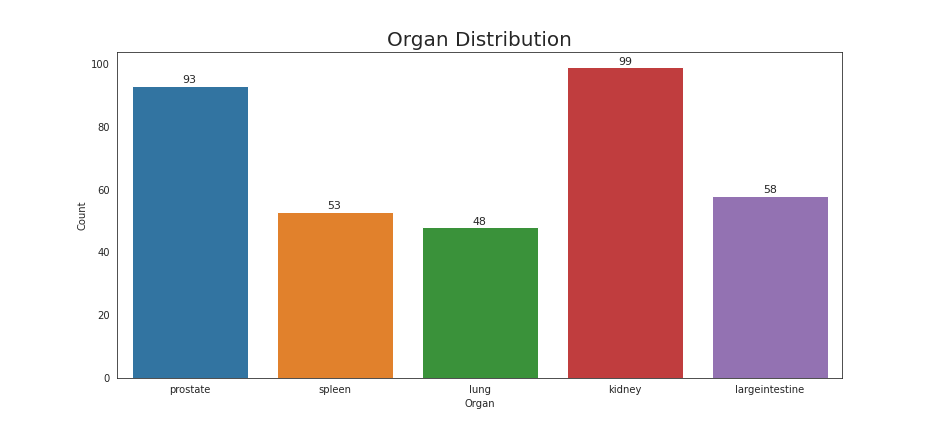
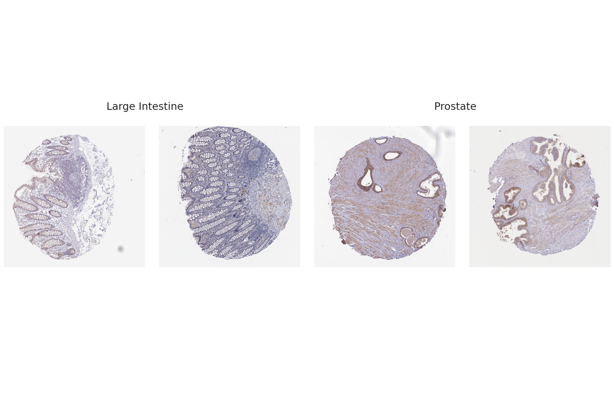
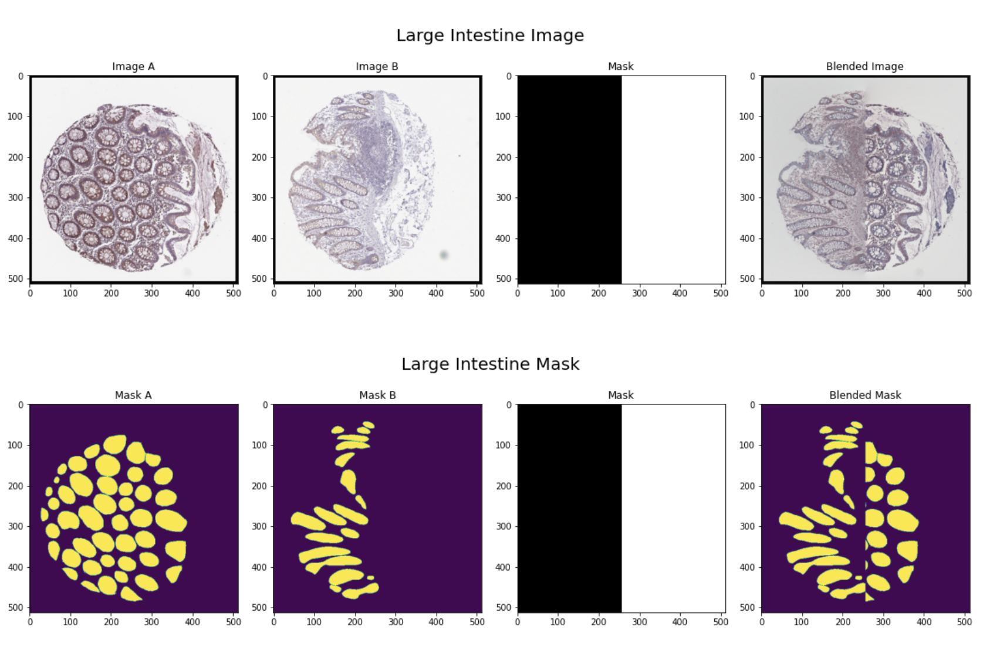
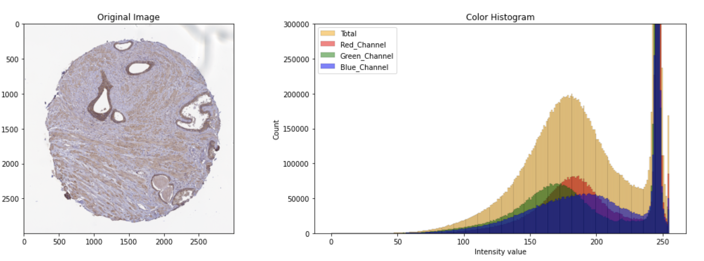
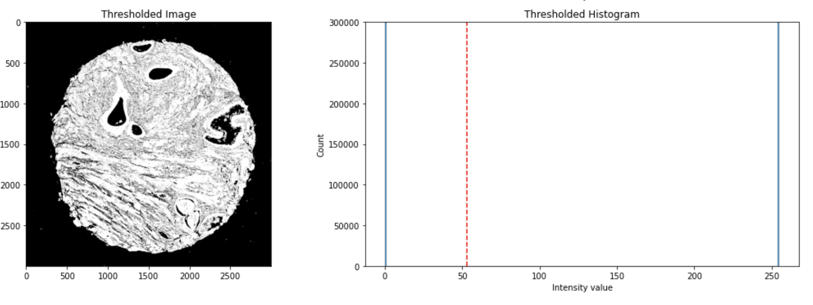

<h1 style="font-family: Verdana; font-size: 28px; font-style: normal; font-weight: bold; text-decoration: none; text-transform: none; letter-spacing: 3px; background-color: #CCCCFF; color: black;"><center><br>HuBMAP + HPA 👀: Hacking the Human Body</center></h1>


---
This is a work in progress!
---
## Tech Stack: 
[Pytorch](https://pytorch.org/)

[Albumentations](https://albumentations.ai/docs/) for augmentations

[Semi-Supervised ImageNet1K Models](https://github.com/facebookresearch/semi-supervised-ImageNet1K-models/blob/master/hubconf.py) for modeling

## Task description:

---

In this [Kaggle competition](https://www.kaggle.com/competitions/hubmap-organ-segmentation), we'll **identify and segment functional tissue units (FTUs)** accross **five** human organs:

* Prostate
* Spleen
* Lung
* Kidney
* Large Intestine

The challenge in this competition is to build algorithms that **generalize**:
* across different **organs** and
* across different **dataset** differences

=> This is a **semantic segmentation** problem.

## Data description:

---

They only release public *Human Protein Atlas (HPA)* data for the training dataset. However, they will release private *HPA* data and *Human BioMolecular Atlas Program (HuBMAP)* for their public test set. For the private test set, they only use *HuBMAP* data.

## Methodology:

---

Since we don’t have the computation resources, we will focus more on **data augmentation**, **data collection**, **hyperparameter tuning**, and **post-processing**.


### Data preparation + preprocessing:

* **Class imbalance**: collect external data on many stains of PAS, H&E, DAB/H of the target organs, augment imbalance classes using the pyramid blending technique



* **Staining and imaging protocols**: -> inter- and intra-class variability -> augmentation: basic, morphology, color 



* **Gaussian Laplacian Pyramid Blending**: generate more data within classes. This technique aims to improve the generalization ability of ML algorithms dealing with HIs. Demo from blending image + mask from large intestine



* **Data standardization**: using avg mean and std

* **Tissue, artifact, and background**: -> deep tissue detector (filtering techniques like triangle, Otsu, CNN): -> detect tissue, artifact, and background ->reduce the quantity, increase the quality of the image data to be analyzed -> only tissues are selected for further analysis. Tissue augmentation using Otsu's binarization technique. Demo:





### Model architecture:
* UNeXt101: based on U-NET architecture with a semi-weakly supervised ResNet101 as a backbone encoder
* Transfer learning to reduce the risk of overfitting
* UNeXt50 (baseline)

### Training, validation setup:
* Training + validation: 70-30 or 80-20 split
  * WSIs or tile-wise images: important that the partition between training, validation and test-set is at the patient-level -> partition patients between the sets is a good first step
  * CV, bootstrapping
* Loss functions: BCE, and symmetric Lovasz
* Iterations: 1000 with slicing learning rates (higher learning rate in the beginning and gradually decreasing learning rate in the end)

### Inference:
* **Metric**: mean Dice coefficient
* **Post-processing**:
  * Center tiling -> assume all the masks are in the center tiles -> only predict and average predictions on the center tiles
  * Cascade PSP (optional)
* **Result visualization**

* Evaluation and Inference of the predictions from multiple models with Test Time Augmentation(TTA)

## Usage:

---

Clone the repository

**1. Data Exploration**

  * Visualize data using `notebooks/EDA.ipynb`

**2. Stain Normalization**

  * Normalize training data based on StainNet using `notebooks/Stain_Normalization.ipynb`
  
**3. Data Augmentation: Pyramid Blending**

  * Blend images and masks based on organ to augment imbalanced classes (spleen, lung, and large intestine) using `notebooks/data-augmentation-laplacian-pyramid-blending.ipynb`
  
**4. WSI Preprocessing**
  * Tile and identify tissue/non-tissue based on thresholding technique using `notebooks/wsi-preprocessing-tiling-tissue-segmentation.ipynb`

**5. Train**

  * Train models using `notebooks/training-fastai-baseline.ipynb`

**6. Inference**

  * Validate models and generate submissions using `notebooks/inference-fastai-baseline.ipynb`

## Code structure

---

```
src
├── data
│   ├── dataset.py              # Torch dataset
│   └── transforms.py           # Augmentation
├── data_preparation
│   ├── data_preparation.py     # Generate rescaled + tilede dataset
│   ├── dataset.py              # Torch dataset
│   ├── get_config.py           # Configuration
│   └── utils.py                # Util functions
├── inference
│   └── test.py                 # Test inference
├── models
│   └── models.py               # Model architectures
├── params.py                   # Main parameters
├── training
│   ├── predict.py              # Prediction helper functions
│   └── train.py                # Model fitting
└── utils
    ├── lovasz_loss.py          # Loss functions
    ├── metrics.py              # Metrics used in the competition
    └── rle.py                  # RLE encoding utils
```
